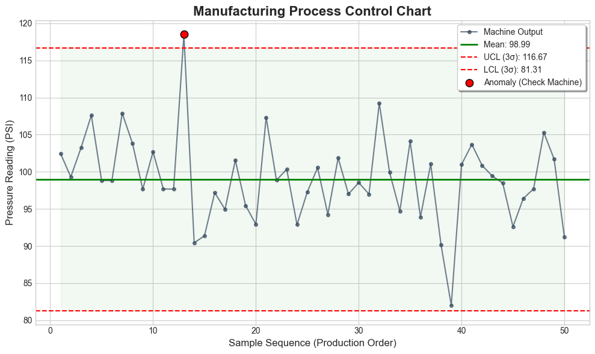

# Manufacturing Process Analysis & EDA — Statistical Process Control

---

## Overview

A Python-based manufacturing process analysis project that combines Exploratory Data Analysis (EDA), cluster sampling, and Statistical Process Control (SPC) to detect machine anomalies and monitor production quality. The analysis identifies abnormal machine behavior using 3-sigma control charts and provides actionable insights for predictive maintenance and quality management.

---

## Business Problem

Manufacturing systems generate continuous sensor and process data, but identifying performance issues and quality risks in real time is difficult without structured statistical methods. Traditional visual inspection and manual review miss subtle deviations that signal impending failures.

This project addresses that by:
- Applying EDA to understand sensor distributions and correlations
- Using cluster sampling to work with large datasets efficiently
- Implementing SPC control charts to flag machines operating outside safe limits
- Providing a reusable anomaly detection framework for manufacturing environments

---

## Dataset

The dataset contains manufacturing process sensor readings sampled using **cluster sampling** — a statistical method that divides the population into natural groups (clusters) and randomly selects entire clusters for analysis. This approach ensures representative coverage while reducing computational load on large datasets.

| Feature | Description |
|---------|-------------|
| Machine ID | Unique identifier for each machine |
| Sensor Readings | Process measurements (temperature, pressure, vibration, etc.) |
| Production Values | Output measurements per machine per time period |
| Process Timestamps | Time index for trend and anomaly analysis |

> **Cluster Sampling:** Rather than analyzing every data point, the dataset is divided into machine clusters. A random selection of clusters is analyzed — this preserves statistical representativeness while keeping the analysis computationally efficient.

---

## Methodology

### Step 1 — Data Preparation
- Loaded and cleaned raw manufacturing dataset
- Normalized column names for consistency
- Handled missing and null values
- Applied cluster sampling to select representative machine groups

### Step 2 — Exploratory Data Analysis (EDA)
- Analyzed distributions of sensor readings across machines
- Identified correlations between process variables
- Detected outliers using boxplots and statistical summaries
- Visualized production patterns across time and machine groups

### Step 3 — Statistical Process Control (SPC)

Implemented the **3-Sigma Control Chart** method:

```python
mean = data['sensor_value'].mean()
std  = data['sensor_value'].std()

UCL = mean + 3 * std   # Upper Control Limit
LCL = mean - 3 * std   # Lower Control Limit

# Flag anomalies
anomalies = data[(data['sensor_value'] > UCL) | (data['sensor_value'] < LCL)]
```

| Parameter | Formula | Description |
|-----------|---------|-------------|
| Mean (μ) | `mean(sensor_values)` | Process center line |
| UCL | `μ + 3σ` | Upper Control Limit — max acceptable value |
| LCL | `μ - 3σ` | Lower Control Limit — min acceptable value |
| Anomaly | `value > UCL or value < LCL` | Point flagged as out-of-control |

---

## Control Chart — Anomaly Detection



The control chart plots sensor readings over time with UCL and LCL thresholds marked. Points outside the control limits are flagged as anomalies — indicating machines operating outside normal process behavior.

---

## Key Insights

- Sensor readings follow a consistent distribution with identifiable outliers in specific machine clusters
- Control chart analysis successfully detected machines operating outside the 3-sigma limits
- Cluster sampling provided representative coverage without analyzing the full dataset
- Anomalies are not random — specific machines and time periods show higher deviation frequency
- Early anomaly detection enables maintenance scheduling before failures occur

---

## Project Structure

```
├── manufacturing_insights.ipynb    # Main analysis notebook (EDA + SPC)
├── Image.png                       # Control chart — anomaly detection output
├── Requirements.txt                # Python dependencies
└── README.md                       # Project documentation
```

---

## How to Run

```bash
# 1. Clone the repository
git clone https://github.com/ramubattu321/manufacturing-process-analysis-eda.git
cd manufacturing-process-analysis-eda

# 2. Install dependencies
pip install -r Requirements.txt

# 3. Open the notebook
jupyter notebook manufacturing_insights.ipynb
```

---

## Business Impact

- **Early anomaly detection** — flags machines deviating from normal behavior before failures occur
- **Predictive maintenance** — enables data-driven maintenance scheduling instead of time-based schedules
- **Quality control** — monitors production consistency and flags process deviations in real time
- **Operational efficiency** — reduces unplanned downtime by identifying high-risk machines early
- **Scalable framework** — cluster sampling approach scales to large industrial datasets

---

## Tools & Technologies

| Tool | Purpose |
|------|---------|
| Python | Core analysis language |
| Pandas | Data loading, cleaning, and transformation |
| NumPy | Statistical calculations (mean, std, UCL, LCL) |
| Matplotlib | Control chart and trend visualization |
| Seaborn | Distribution plots and correlation heatmaps |
| Jupyter Notebook | Interactive analysis environment |

---

## Applications

- Manufacturing quality monitoring
- Predictive maintenance scheduling
- Process stability assessment
- Industrial IoT sensor data analysis
- Real-time anomaly alerting systems

---

## Author
Ramu Battu

**Ramu Battu**
MS in Data Analytics — California State University, Fresno
📧 ramuusa61@gmail.com
